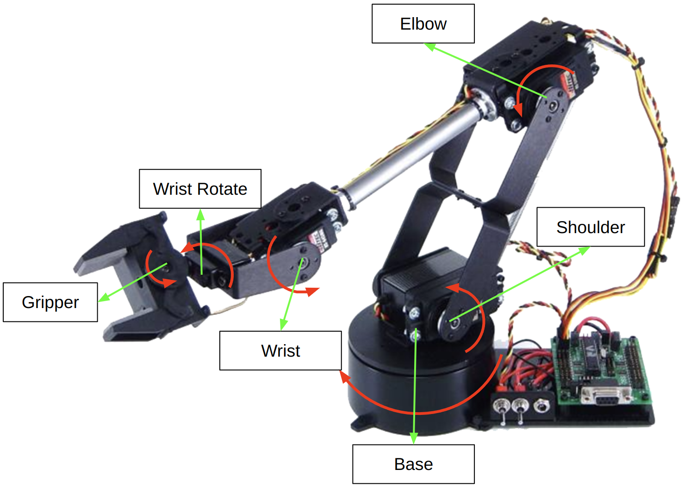
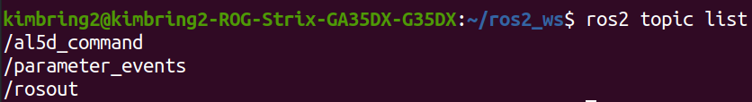

# 1. Introduction
ROS2 package to control the [AL5D robot arm of Lynxmotion](https://www.robotshop.com/products/lynxmotion-al5d-4-degrees-freedom-robotic-arm-combo-kit).

# 2. Setting the robot side code
- Directly commnication between ROS2 and motor of robot is impossible. You need to upload the [Arduino program](https://drive.google.com/file/d/1dJOSnEAfzrh7GTa5parboIpwfxzVnE51/view?usp=sharing) into the controller board of robot called the [BotBoarduino](https://www.robotshop.com/products/lynxmotion-botboarduino-robot-controller). That board is same as Arduino Duemilanove.

- Command Protocol
The one example of command protocol is **^b065s135e010w090g120w000$**.
The first '^' and last $ means the start and end of command string. Another parts are for sending the desired angle for them. 
  - b065: Base Rotate Angle
  - s135: Shoulder Rotate Angle
  - e010: Elbow Rotate Angle
  - w090: Wrist Rotate Angle
  - g120: Gripper motor rotate angle
  - w000: WristRotate Rotate Angle


  
The Aruino code parse that command and give a PWM signal to each motors of robot.
  
- Download this repository under the src folder of your ROS2 workspace.
```
$ colcon build --packages-select al5d_arm_ros2
```

- Build the ROS2 package using below command.
```
$ colcon build --packages-select al5d_arm_ros2
```

- Run the built package using below command.
```
$  ros2 run al5d_arm_ros2 controller
```

- Now you should see the ROS2 topic called 'al5d_command'.


- Finally, publish the command using the below command.
```
$ ros2 topic pub -r 10 /command std_msgs/msg/String "{data: '^b090s135e010w090g120w000$'}" --once
```
